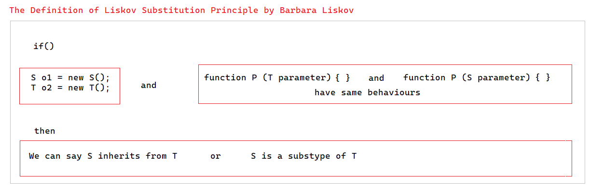

# SOLID | Liskov Substitution Prensibi

```
Bu prensip adını Barbara Liskov'dan almaktadır. 
MIT'de profesor olan Liskov, 80'li yıllarda çıkardığı bir kitabında ilk defa bu prensipten bahsetmiştir.
Kitabında yer alan açıklama tamamen matematiksel bir dilde olup çoğu insan tarafından açıklayıcı bulunmamıştır.
Birçok türk/yabancı blog yazarı olabildiğince açık ifadeler paylaşmaya çalışmıştır.
Buradaki açıklamalarım her ne kadar kısa ve öz olsun istesem de aşağıya Liskov'un cümlesini ve anladığımı şematik bir şekilde eklemek isterim.

> *What is wanted here is something like the following substitution property: 
   If for each object o1 of type S there is an object o2 of type T such that for all programs P defined in terms of T, 
   the behavior of P is unchanged when o1 is substituted for o2 then S is a subtype of T.*




Bu prensipte asıl amaç şu şekildedir diyebiliriz:
Bazen olabilidiğince clean code mantığına yatkın olacak şekilde kod yazmak için aynı sınıftan türemesi adına base class'lar oluştururuz.
Ve bu base class'larda yer alan metot veya özelliklerin alt sınıflarda da olması için override olmasını zorunlu tutarız.
Çünkü aslında o base class olduğu için ondan türeyenlerin de aslında ondan türediğini belirtmek isteriz.
Böyle durumlarda base class'ta olması zorunlu olan ancak alt sınıfta olması zorunlu olmayan özellik/metotlar oluşabilmektedir.
Liskov da bu durumları engellemek için izlenebilecek bir çözümdür diyebiliriz aslında.

Bahsettiğim bu duruma yönelik açıklama örnek class'ta yer almaktadır.

```

```
Bu proje içerisinde her uygulama için bir klasör oluşturulmuş olup her uygulama için prensibin uygulanmış ve uygulanmamış hali olmak üzere iki adet class oluşturulmuştur.
Her class içerisinde uygun açıklamalar bulunmaktadır.
```